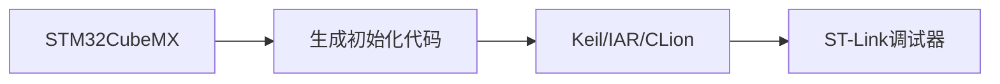

# STM32全面解析：从入门到实战指南

## 目录
1. [STM32概述](#1-stm32概述)
2. [产品系列详解](#2-产品系列详解) 
3. [开发环境搭建](#3-开发环境搭建)
4. [快速入门示例](#4-快速入门示例)
5. [学习资源推荐](#5-学习资源推荐)
6. [应用案例](#6-应用案例)
7. [学习路线](#7-学习路线)

---

## 1. STM32概述

STM32是**意法半导体（STMicroelectronics）**推出的基于**ARM Cortex-M**内核的32位微控制器系列，自2007年发布以来已成为嵌入式系统开发的主流选择。

### 核心优势：
- ✅ **高性能ARM架构**：Cortex-M0/M3/M4/M7多系列可选
- ✅ **丰富外设**：集成USB/CAN/I2C/SPI/ADC等接口
- ✅ **低功耗设计**：STM32L系列待机电流低至0.3μA
- ✅ **完善生态**：官方提供STM32CubeMX配置工具和HAL库

---

## 2. 产品系列详解

| 系列 | 内核 | 主频 | 特色 | 典型应用 |
|------|------|------|------|----------|
| STM32F0 | M0 | 48MHz | 入门级性价比 | 消费电子 |
| STM32F1 | M3 | 72MHz | 经典"蓝桥杯"芯片 | 工业控制 |
| STM32F4 | M4 | 180MHz | 带DSP浮点运算 | 数字信号处理 |
| STM32H7 | M7 | 480MHz | 双核高性能 | 图形界面 |
| STM32L4 | M4 | 80MHz | 低功耗+高性能 | 物联网设备 |
| STM32U5 | M33 | 160MHz | 新一代安全内核 | 支付终端 |

> 📌 选购建议：初学者推荐STM32F103C8T6（20元左右的"最小系统板"）

---

## 3. 开发环境搭建

### 3.1 工具链组合


### 3.2 软件安装步骤

1. **STM32CubeMX**（图形化配置）
   - 自动生成引脚分配时钟树配置
   - 支持HAL/LL库代码生成
2. **IDE选择**：
   - 免费方案：STM32CubeIDE（基于Eclipse）
   - 商业方案：Keil MDK（μVision）
   - 开源方案：VSCode + PlatformIO
3. **驱动安装**：
   - ST-Link/V2调试器驱动
   - USB转串口驱动（CH340/CP2102）

## 4. 快速入门示例

### 4.1 GPIO控制LED

```c
// main.c (HAL库示例)
#include "stm32f1xx_hal.h"

void SystemClock_Config(void);

int main(void) {
  HAL_Init();
  SystemClock_Config();
  
  // 启用GPIOC时钟
  __HAL_RCC_GPIOC_CLK_ENABLE();
  
  // 配置PC13为输出
  GPIO_InitTypeDef gpio = {0};
  gpio.Pin = GPIO_PIN_13;
  gpio.Mode = GPIO_MODE_OUTPUT_PP;
  gpio.Pull = GPIO_NOPULL;
  gpio.Speed = GPIO_SPEED_FREQ_LOW;
  HAL_GPIO_Init(GPIOC, &gpio);

  while(1) {
    HAL_GPIO_TogglePin(GPIOC, GPIO_PIN_13);
    HAL_Delay(500); // 500ms间隔
  }
}
```

### 4.2 关键知识要点

1. **时钟树配置**：所有外设需先使能时钟
2. **GPIO模式**：
   - 推挽输出(OUTPUT_PP)
   - 开漏输出(OUTPUT_OD)
   - 上拉输入(INPUT_PULLUP)

## 5. 学习资源推荐

### 5.1 官方资源

- [STM32中文官网](https://www.stmcu.com.cn/)
- [STM32Cube软件包](https://www.st.com/en/embedded-software/stm32cube-mcu-mpu-packages.html)
- [GitHub官方例程](https://github.com/STMicroelectronics)

### 5.2 推荐书籍

- 《STM32库开发实战指南》（刘火良著）
- 《Cortex-M3/M4权威指南》
- 《FreeRTOS实时内核实战指南》

### 5.3 开发板推荐

1. 入门级：正点原子Mini板（F103RCT6）
2. 进阶款：野火指南者（F407ZGT6）
3. 物联网：STM32U575IOT开发套件


## 6. 应用案例

### 工业控制方案

- Modbus RTU协议实现
- PID电机控制算法
- 4-20mA模拟量采集

## 7. 学习路线

### 分阶段学习建议

1. **基础阶段（1-2周）**：
   - GPIO控制
   - 外部中断
   - 定时器基础
2. **进阶阶段（3-4周）**：
   - PWM输出
   - ADC/DAC采集
   - USART通信
3. **高级阶段（1-2月）**：
   - FreeRTOS移植
   - LWIP网络协议栈
   - GUI开发（LVGL/emWin）


📌 **创作声明**
本文档持续更新，获取最新版请访问：
