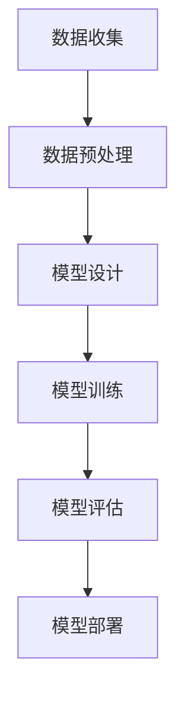

# **深度学习：智能时代的引擎**

## **一. 深度学习的前世今生**

深度学习（Deep Learning）是机器学习的分支，源自人工神经网络（ANN），经历了数十年的发展：

| 阶段         | 代表方法/事件                | 特点与局限                |
| ------------ | --------------------------- | ------------------------- |
| 1940s-1980s  | 感知机、早期神经网络         | 结构简单，能力有限        |
| 1986         | 反向传播算法（BP）           | 可训练多层网络            |
| 1998         | LeNet（手写数字识别）        | 卷积神经网络雏形          |
| 2006         | 深度信念网络（Hinton）       | 深层网络训练突破          |
| 2012         | AlexNet（ImageNet冠军）      | GPU加速，深度模型爆发      |
| 2016-至今    | Transformer、GPT、Diffusion | 泛化能力、生成能力提升    |

> 深度学习推动了语音识别、图像处理、自然语言理解等领域的飞跃发展。

---

## **二. 深度学习的典型流程**

- **数据收集**：获取原始数据（如图片、文本、音频等）
- **数据预处理**：清洗、归一化、增强等
- **模型设计**：选择网络结构（如CNN、RNN、Transformer）
- **模型训练**：通过反向传播优化参数
- **模型评估**：验证模型泛化能力
- **模型部署**：上线服务或嵌入设备

---

## **三. 深度学习的核心公式**

以典型的前馈神经网络为例，其基本计算过程如下：

$$
\text{输入层：} \quad \mathbf{x} = [x_1, x_2, ..., x_n] \\
\text{隐藏层：} \quad \mathbf{h} = \sigma(\mathbf{W}_1 \mathbf{x} + \mathbf{b}_1) \\
\text{输出层：} \quad \mathbf{y} = \text{softmax}(\mathbf{W}_2 \mathbf{h} + \mathbf{b}_2)
$$

- $\sigma$：激活函数（如ReLU、Sigmoid）
- $\mathbf{W}, \mathbf{b}$：权重与偏置参数
- $\text{softmax}$：常用于分类任务的输出

**损失函数（以交叉熵为例）：**

$$
L = -\sum_{i} y_i^{\text{true}} \log(y_i^{\text{pred}})
$$

**参数优化（梯度下降）：**

$$
	heta \leftarrow \theta - \eta \frac{\partial L}{\partial \theta}
$$

- $\theta$：模型参数
- $\eta$：学习率

---

## **四. 发展趋势与展望**

- **大模型**：参数规模持续增长，能力更强
- **多模态**：融合文本、图像、音频等多种信息
- **自动化**：AutoML、神经架构搜索（NAS）
- **绿色AI**：关注能耗与效率

> 深度学习正成为推动AI变革的核心动力，未来可期。

---
