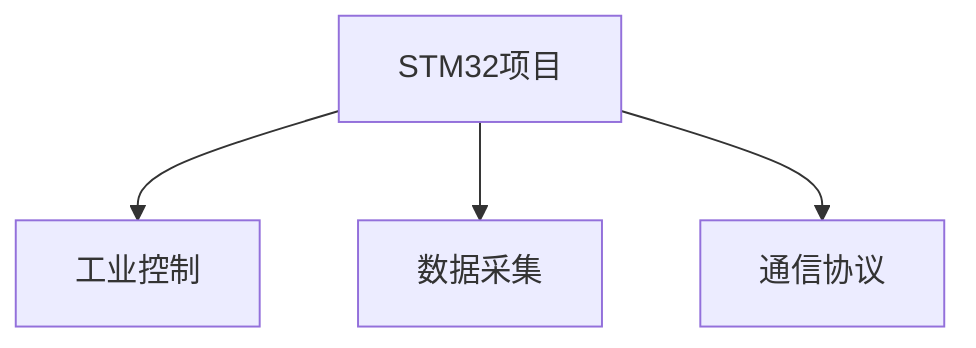

# 我的技术成长之路：从入门到进阶

## 目录
1. [学习历程](#1-学习历程)
2. [技术栈演进](#2-技术栈演进)
3. [项目经验](#3-项目经验)
4. [心得体会](#4-心得体会)
5. [未来规划](#5-未来规划)

---

## 1. 学习历程

### 1.1 入门阶段
- 2018年：开始接触编程，从C语言基础开始
- 2019年：学习STM32单片机开发
- 2020年：深入嵌入式系统开发

### 1.2 进阶阶段
- 2021年：开始学习深度学习
- 2022年：参与K230开发板项目
- 2023年：技术博客写作与分享

---

## 2. 技术栈演进

| 时间 | 技术领域 | 主要成就 | 应用场景 |
|------|----------|----------|----------|
| 2018-2019 | C语言基础 | 完成基础算法实现 | 编程入门 |
| 2019-2020 | STM32开发 | 完成多个嵌入式项目 | 工业控制 |
| 2021-2022 | 深度学习 | 图像识别项目 | AI应用 |
| 2022-2023 | K230开发 | 边缘计算应用 | 智能设备 |

## 3. 项目经验

### 3.1 嵌入式开发项目

### 3.2 深度学习项目
- 图像识别系统
- 目标检测应用
- 模型部署优化

## 4. 心得体会

### 4.1 学习建议
1. **循序渐进**：打好基础，逐步深入
2. **实践为主**：多做项目，及时总结
3. **持续学习**：保持技术敏感度

### 4.2 技术分享
- 通过博客记录学习过程
- 参与开源项目
- 技术社区交流

## 5. 未来规划

### 5.1 短期目标
- 深入边缘计算领域
- 完善技术博客体系
- 参与更多开源项目

### 5.2 长期规划
- 建立个人技术品牌
- 开发创新性项目
- 推动技术社区发展

---

📌 **创作声明**
本文档持续更新，获取最新版请访问： 